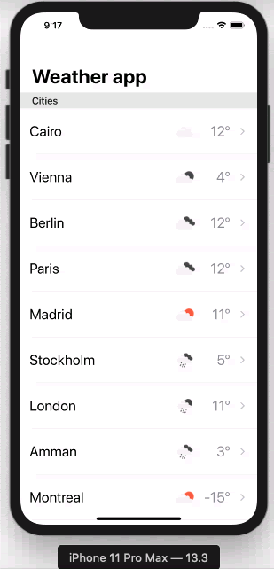

# Weather-For-Three-Days

It allows you to fetch current weather for some static cities around the world and fet today forecasts along the next three coming days using [open weather api](https://openweathermap.org/api)

 

## Getting Started

### Prerequisites

- Xcode 11.3
- iOS13
- [Bundle 2.1.4](https://bundler.io/)
- [Fastlane2.141.0](https://fastlane.tools/)

### Installing

#### Bundle
```
bundle install 
```

If Bundle command is not found
```
sudo gem install bundler
```

## Usage

Clone then run :rocket::rocket:

## Features

- Fetch current weather
- Fetch today forecasts
- Fetch next three coming daya

## Unit tests
Navigate to project directory then execute
```
bundle exec fastlane tests_lane
```


## Networking

Use native [Network Layer](https://github.com/marcinjackowski/NetworkLayer), thanks  [Marcin Jackowski](https://github.com/marcinjackowski) for such great work

## Design patterns

- VIPER
- Coordinator
- Delegation

## License

This project is licensed under the MIT License
